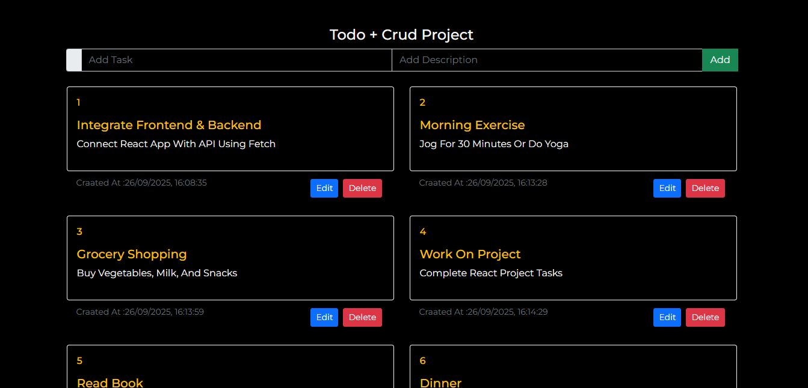

# MERN Stack ToDo Application

A simple **ToDo List application** built with **MongoDB, Express, React, and Node.js (MERN stack)**.  
This project demonstrates full CRUD operations (Create, Read, Update, Delete) and a clean frontend interface.

---

## **Features**

- Add, edit, and delete tasks
- Task title and description
- Display created date/time
- Responsive and simple UI
- Fully connected frontend and backend

---

## **Live Demo**

- **Frontend URL:** https://mern-stack-todo-application-frontend.onrender.com

---

## **Screenshots**

---

## **Tech Stack**

- **Frontend:** React, Bootstrap  
- **Backend:** Node.js, Express  
- **Database:** MongoDB (Atlas)  
- **Hosting:** Render.com

---

